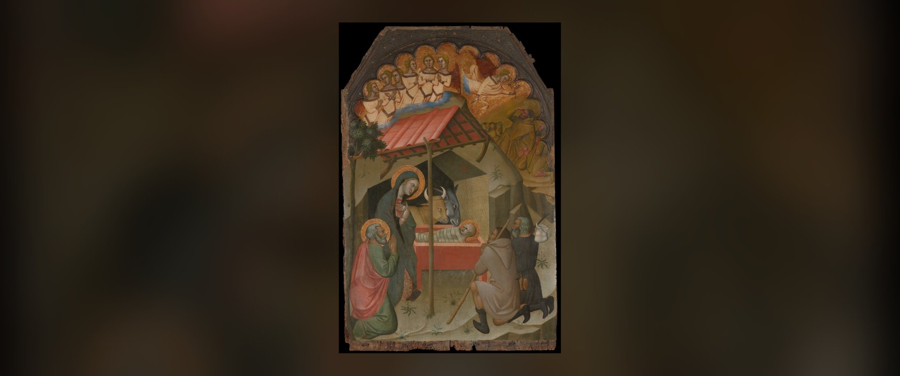
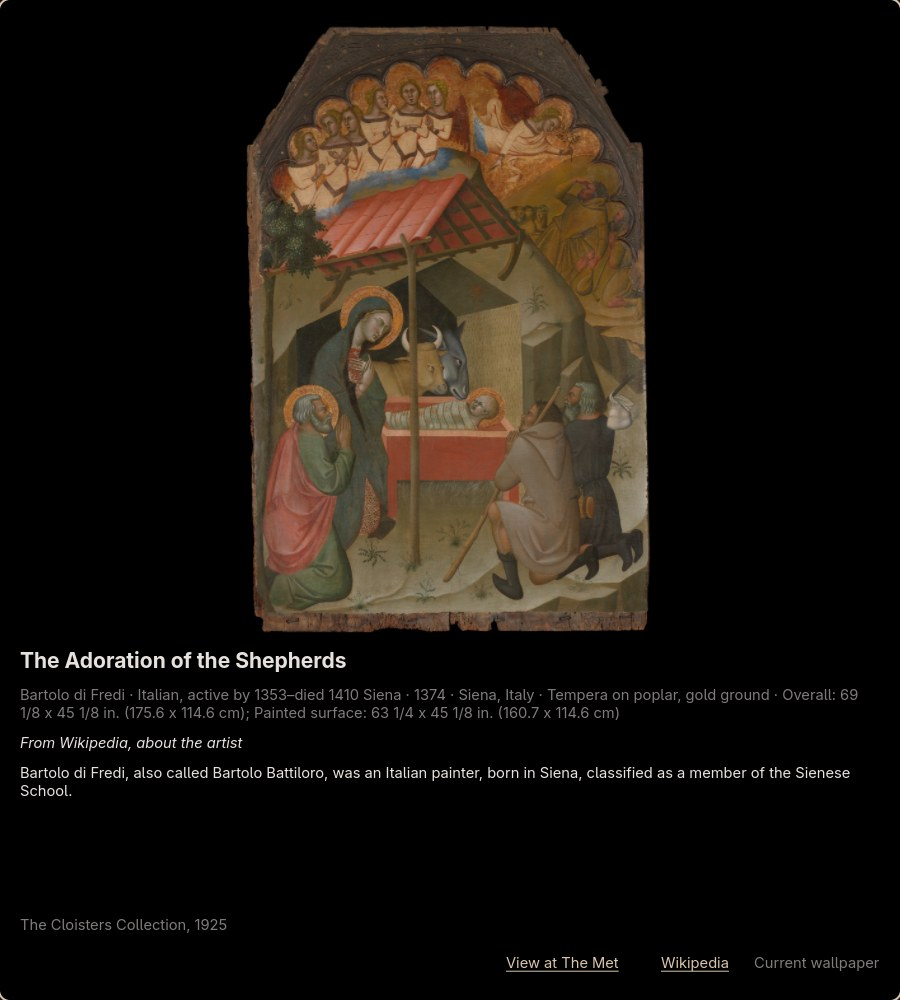

# Ars Mediaevalis

A medieval painting a day as your wallpaper, for [Hyprland](https://hypr.land/) with the
[Noctalia](https://noctalia.dev) shell.



On the first login of each day, Ars Mediaevalis picks a random public-domain painting from
[The Metropolitan Museum of Art](https://www.metmuseum.org/) (including The Met Cloisters), sets it
as the wallpaper on every monitor, and greets you with a small window about the work. For the rest
of the day it leaves things alone.

## Features

- **One painting per day.** Later logins on the same day re-apply the same painting without
  touching the network. Works that have been shown are not repeated until the whole pool has been
  seen.
- **Paintings only.** Each candidate is checked against the Met's own classification, so
  manuscripts, textiles, sculptures and facsimiles are skipped.
- **Wallpapers that fit any shape.** Tall altarpiece panels and wide predellas are placed whole,
  with a margin, over a blurred and darkened copy of themselves. Each monitor gets a wallpaper
  composed at its own resolution, with rotation taken into account.
- **A greeting window.** A floating window shows the painting with its maker, date, place, medium
  and a short history, taken from the work's Wikipedia article, else the artist's, else the Met's
  catalogue facts. Links lead to the Met and to Wikipedia.
- **A way back.** If today's painting is not to your liking, page through the earlier ones still in
  the cache and set any of them again. Nothing is fetched for that, and there is deliberately no
  "give me another" button: a new painting only comes with a new day.
- **A shell that matches.** With Noctalia's colour scheme set to follow the wallpaper, every day's
  painting retints the bar and the rest of the shell.
- **Fails politely.** Without a network, yesterday's painting stays and the day is retried on the
  next run. Outside a Hyprland session nothing is done at all.

<p align="center">
  
</p>

## Requirements

- Hyprland
- Noctalia v5 or later (the `noctalia msg wallpaper-set` command)
- GTK 4 with GObject introspection, for the window
- Python 3.12 or later and [uv](https://docs.astral.sh/uv/)
- A C compiler, `pkg-config` and the cairo headers, since PyGObject is built on install

On Arch Linux and its derivatives:

```
sudo pacman -S gtk4 gobject-introspection cairo pkgconf base-devel uv
```

Other compositors and wallpaper daemons are not supported.

## Installation

```
git clone https://github.com/ClaudioRMalvino/ars-mediaevalis.git
cd ars-mediaevalis
uv tool install .
```

This installs the `ars_mediaevalis` command into `~/.local/bin/`, in its own environment, so the
clone can be moved or deleted afterwards. Try it:

```
~/.local/bin/ars_mediaevalis run
```

The first run searches the Met's collection to build its pool of candidates, which takes a few
seconds; after that the pool is cached for 30 days.

To update, pull and run `uv tool install --reinstall .`; to remove it, `uv tool uninstall ars-mediaevalis`.

## Hyprland setup

The examples use Hyprland's Lua configuration (`~/.config/hypr/hyprland.lua`).

Start it at login:

```lua
hl.on("hyprland.start", function()
	hl.exec_cmd("~/.local/bin/ars_mediaevalis run")
end)
```

Make the window a floating, centred greeting:

```lua
hl.window_rule({
	name = "ars-mediaevalis",
	match = { class = "^io\\.github\\.claudiormalvino\\.ArsMediaevalis$" },
	float = true,
	size = { 900, 1000 },
	center = true,
})
```

To have the shell follow the painting's colours, set Noctalia's colour scheme source to the
wallpaper in its settings. Also turn off Noctalia's own wallpaper rotation, or it will replace the
painting.

`run` is idempotent and locked against concurrent runs, so it does not matter how often it is
triggered. A monitor that is disabled when the painting is set (a laptop screen with the lid
closed) gets it on the next run; call `ars_mediaevalis run` from a lid-open handler to make that
immediate.

### Optional: a systemd timer

If your session stays up for days (suspend instead of logout), nothing triggers a new day. The user
timer in `systemd/` runs just after midnight, and hourly as a retry for a day that failed:

```
mkdir -p ~/.config/systemd/user
cp systemd/ars_mediaevalis.service systemd/ars_mediaevalis.timer ~/.config/systemd/user/
systemctl --user daemon-reload
systemctl --user enable --now ars_mediaevalis.timer
```

The service runs `~/.local/bin/ars_mediaevalis`, where `uv tool install` put it. With the timer, the
greeting window opens whenever the new painting arrives, which may be at midnight while you are
working.

## Usage

| Command | Does |
|---------|------|
| `ars_mediaevalis run` | the daily rule: a new painting on a new day, else re-apply today's |
| `ars_mediaevalis show` | open the window: the current artwork, and the earlier ones to page through |
| `ars_mediaevalis info` | print the current artwork to the terminal |
| `ars_mediaevalis list` | list the earlier artworks still in the cache |
| `ars_mediaevalis use <id>` | bring back an earlier artwork from the cache, without any download |

In the window, **‹ Earlier** and **Later ›** page through the cached artworks, **Use as wallpaper**
sets the one on screen, and Escape closes it. A chosen artwork stays for the rest of the day.

```
$ ars_mediaevalis info
The Adoration of the Shepherds
Bartolo di Fredi · 1374 · Siena, Italy
Tempera on poplar, gold ground

Bartolo di Fredi, also called Bartolo Battiloro, was an Italian painter, born in Siena,
classified as a member of the Sienese School.

https://www.metmuseum.org/art/collection/search/470600
https://en.wikipedia.org/wiki/Bartolo_di_Fredi
```

Add `-v` before the command for debug logging. Exit code 0 means the artwork is on the screens; 1
means something was missing (no network, no Hyprland session, Noctalia not answering).

## How it works

```
login ──► ars_mediaevalis run
              │
              ├─ same day ──► re-apply today's painting (no network)
              │
              └─ new day ───► pick a painting not shown before     museums/met.py, artwork.py
                              look up its history                  history.py
                              download the image                   artwork.py
                              compose a wallpaper per monitor      picker.py
                              hand it to Noctalia                  picker.py
                              open the greeting window             viewer.py
```

| Module | Role |
|--------|------|
| `museums/met.py` | Met Collection API client with retries, paginated search, cached ID pool |
| `artwork.py` | the `Artwork` record, the paintings-only filter, random choice without repeats, image download, the cached earlier artworks |
| `history.py` | Wikidata → Wikipedia lookup with a catalogue fallback |
| `picker.py` | Hyprland monitors, wallpaper composition, Noctalia |
| `state.py` | `state.json` with atomic writes, and the run lock |
| `viewer.py` | the GTK 4 window |
| `cli.py` | the commands and the daily rule |
| `paths.py` | XDG directories |

### Where things live

| Path | Contents |
|------|----------|
| `~/.cache/ars_mediaevalis/pool.json` | the pool of candidate object IDs, rebuilt every 30 days |
| `~/.cache/ars_mediaevalis/images/` | downloaded images with their details, and the composed wallpapers |
| `~/.local/state/ars_mediaevalis/state.json` | the current artwork, shown and rejected IDs |
| `~/.local/state/ars_mediaevalis/ars_mediaevalis.log` | log of every run |

The directories follow the XDG Base Directory variables if they are set. Deleting the cache costs a
re-download of today's image and forgets the earlier artworks you could go back to. Deleting the
state forgets today's pick and which works have been shown.

### Changing what is picked

The searches that build the pool are the `QUERIES` list in `src/ars_mediaevalis/museums/met.py`: by
default The Cloisters, Medieval Art, and European Paintings from 1200 to 1500. The pool is rebuilt
automatically when the list changes. The appearance of the wallpaper is set by the constants at the
top of `src/ars_mediaevalis/picker.py` (margin, background brightness, maximum upscale).

## Development

```
uv sync
uv run ars_mediaevalis run
uv run python -m unittest discover -s tests -p "*_test.py" -t .
```

`uv sync` creates `.venv/` with an editable install, so changes to the source take effect at once.

The tests use no network and do not touch the desktop: HTTP goes through `httpx.MockTransport`,
`hyprctl` and `noctalia` are mocked, and the XDG directories point at temporary ones.

Two opt-in tests do reach outside. `ARS_LIVE_TESTS=1` queries the real Met API, and
`ARS_LIVE_WALLPAPER=1` sets a random painting as your real wallpaper.

## Credits

- Images and catalogue data come from The Metropolitan Museum of Art's
  [Open Access](https://www.metmuseum.org/about-the-met/policies-and-documents/open-access)
  programme through the [Met Collection API](https://metmuseum.github.io/). Only works the Met
  marks as public domain are used.
- History texts come from [Wikipedia](https://www.wikipedia.org/), found through
  [Wikidata](https://www.wikidata.org/), and are available under
  [CC BY-SA 4.0](https://creativecommons.org/licenses/by-sa/4.0/).
- The painting shown above is *The Adoration of the Shepherds* by Bartolo di Fredi (1374), The
  Cloisters Collection.

This project is not affiliated with The Metropolitan Museum of Art, Hyprland or Noctalia.

## License

The code is released under the [MIT License](LICENSE). The paintings are in the public domain; the
history texts shown in the window remain under Wikipedia's CC BY-SA 4.0 licence.
